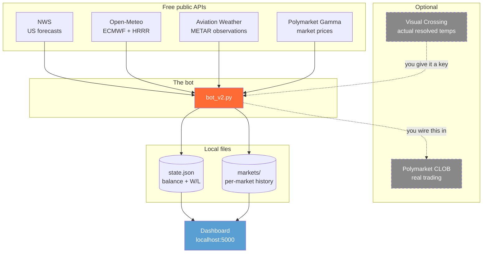
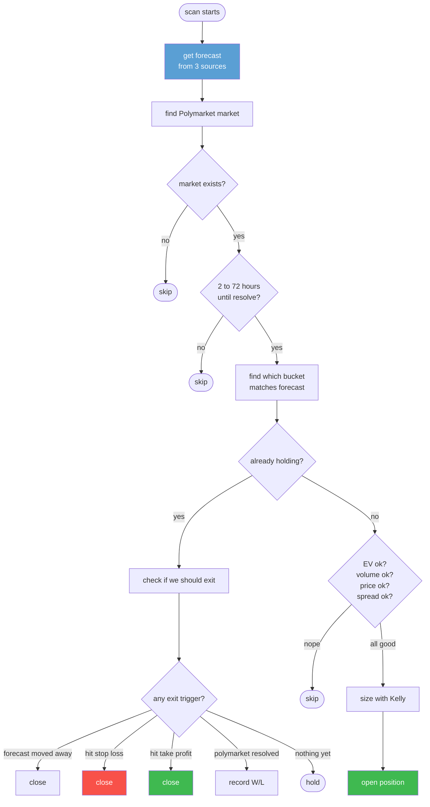
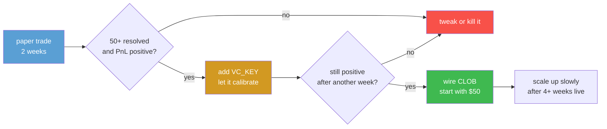

# 🌤 Weatherbot

A Polymarket trading bot that bets on daily high temperature markets using real weather forecasts.

Open source. Runs locally. Paper-trades by default. Wire in real money only when you've proven the strategy works in simulation.

```
forecast (ECMWF + HRRR + METAR)  →  find matching Polymarket bucket  →  is it underpriced?  →  buy
```

That's the whole idea. Everything else is plumbing.

---

## ⚠️ Read this before you do anything

This is a fork-and-extend project. The bot works end-to-end for paper trading out of the box. The live trading code is scaffolded with safety checks but not wired in by default. You have to enable it yourself, on purpose, after you've seen the strategy work.

**Before you connect any wallet to this bot:**

1. Run paper trading for at least 2 weeks
2. Resolve at least 50 markets
3. Check that your total PnL is consistently positive
4. Read the live trading section at the bottom of this README
5. Run the diagnostic: `python -m weatherbot.live_trading`
6. Start with `live_max_bet=2` and `live_dry_run_first=true`

If you skip any of these you will lose money. Polymarket has no testnet. Every order is real.

---

## Why this works (sometimes)

Polymarket has thousands of markets and not enough sharp traders covering all of them. Weather markets in particular get sloppy pricing because most retail bettors don't have systematic forecasts. You'll see a bucket priced at 8 cents when the actual probability is 30%+.

That's the gap this bot tries to capture.

It won't always work. Sometimes Polymarket's market makers get smart, sometimes the weather doesn't cooperate, sometimes liquidity dries up. But if you run it in paper mode for a couple weeks and the numbers look good, you've got something.

---

## What you get

Two bots:

**`bot_v1.py`** is the simple one. Six US cities, NWS forecasts, flat 5% positions, fixed thresholds. About 400 lines. Read it first if you want to understand what's happening.

**`bot_v2.py`** is the real deal. 20 cities worldwide, three forecast sources (ECMWF, HRRR, METAR), Kelly sizing, EV filtering, stop-loss, trailing stop, take-profit, sigma calibration that learns from resolved markets. About 1000 lines, but most of it's straightforward.

Plus a local dashboard (Flask + vanilla JS) so you can see what's happening without staring at terminal output.

And 43 tests that run in 0.2 seconds, no network needed.

Plus a `weatherbot/live_trading.py` module with CLOB integration, risk limits, and pre-flight checks. Disabled by default.

---

## How it all fits together



The dashed boxes are optional. You don't need them to start.

---

## What the bot does on every scan



Hourly full scans, every 10 minutes a quick check on open positions. Doesn't hammer the APIs.

---

## The airport thing nobody mentions

This is important and most bots get it wrong.

Polymarket weather markets resolve on a specific airport station. Not the city center. Not "wherever your weather app shows". A specific airport.

NYC resolves on LaGuardia. Dallas on Love Field, not DFW. The temperature difference between city center and the actual resolving airport can be 5 to 8 degrees Fahrenheit. On markets with 1 to 2 degree buckets, that's the difference between winning and losing every single trade.

We use the right coordinates:

| City | Station | Airport |
|------|---------|---------|
| NYC | KLGA | LaGuardia |
| Chicago | KORD | O'Hare |
| Miami | KMIA | Miami Intl |
| Dallas | KDAL | Love Field |
| Seattle | KSEA | Sea-Tac |
| Atlanta | KATL | Hartsfield |

Plus 14 more cities globally in v2. Full list in `weatherbot/common.py`.

If you fork this and change coordinates to your own city, double-check what station Polymarket actually resolves on. They list it in the market description.

---

## Install

You need Python 3.9 or newer.

```bash
git clone https://github.com/<your-username>/weatherbot
cd weatherbot

python3 -m venv venv
source venv/bin/activate

pip install -r requirements.txt

pytest tests/ -v
```

If pytest says `43 passed` you're set. If something fails, fix that first before running the bot.

---

## API keys (or lack thereof)

Here's the honest version of what you need at each stage.

### Stage 1 - paper trading (free, no signup)

Zero keys. Every weather API the bot uses is free and doesn't need authentication. Polymarket's price data is also free. Just clone, install, run.

This is where you should spend your first couple weeks.

### Stage 2 - sigma calibration (optional, free tier)

After markets resolve, the bot wants to know what the actual high temperature was so it can learn how accurate each forecast source is per city. Visual Crossing has a free tier that covers this easily.

```bash
cp .env.example .env
```

Then open `.env` and paste your key after `VC_KEY=`. Get one at https://www.visualcrossing.com/weather-api

The bot works without this, calibration just won't run.

### Stage 3 - real money (only after Stages 1 and 2 work)

You need:

- A Polymarket account (free, sign up with email - this gives you a "Magic wallet")
- USDC on Polygon (chain 137). Bridge from Coinbase, Ethereum, Base, Solana
- The official Python client: `pip install py-clob-client`
- Your private key and funder address from Polymarket
- Patience to read the live trading section before flipping the switch

Wallet setup steps:

1. Sign up on polymarket.com with email
2. Deposit USDC, the deposit page tells you the address
3. In Magic wallet settings, find "Reveal Key" and copy your private key. Treat it like a bank password
4. Your funder address is your Polymarket profile address. Copy that too
5. If you use MetaMask instead of Magic, you also need to set token allowances. Magic users skip this

Add to your `.env`:

```
POLY_PRIVATE_KEY=0x...
POLY_FUNDER_ADDRESS=0x...
LIVE_TRADING=false
```

Note that `LIVE_TRADING=false` by default. You set it to `true` only when you're absolutely ready. The diagnostic command (described below) will refuse to do anything until this flag is on.

Never commit `.env`. It's in `.gitignore` already, don't unignore it.

### Where Polymarket doesn't work

Real talk on geo restrictions. As of 2026:

- US users are blocked on the main platform (there's a separate CFTC-regulated US version with KYC and a waitlist)
- 33+ countries fully blocked, mostly OFAC-sanctioned plus Singapore, Switzerland, and others
- France is close-only (you can exit positions but not open new ones)
- Germany, Italy, Ontario have trading restrictions

VPNs to bypass this are explicitly banned by Polymarket's terms. They monitor wallet activity and freeze accounts that get caught. Just check the official list before you fund anything: https://help.polymarket.com/en/articles/13364163-geographic-restrictions

The bot doesn't care about geo, it'll happily compute signals. But the CLOB will reject your orders if you're in a blocked region.

---

## Running it

### v1 (the simple one)

```bash
python bot_v1.py             # paper mode, just shows signals
python bot_v1.py --live      # paper trade against virtual $1000
python bot_v1.py --positions # show open positions
python bot_v1.py --reset     # start over
```

### v2 (the real one)

```bash
python bot_v2.py             # main loop, runs forever
python bot_v2.py once        # single scan, exit. Good for cron
python bot_v2.py status      # what's open right now
python bot_v2.py report      # full PnL report
python bot_v2.py reset       # nuke everything
```

For continuous running, just `python bot_v2.py` and let it sit. It'll do a full scan every hour and check open positions every 10 minutes between scans.

### Cron it (Linux/macOS)

If you don't want a long-running process:

```bash
crontab -e
```

Add:

```
*/30 * * * * cd /path/to/weatherbot && /path/to/venv/bin/python bot_v2.py once >> bot.log 2>&1
```

Single scan every 30 minutes.

---

## The dashboard

Run it in a second terminal:

```bash
python dashboard/app.py
```

Open http://127.0.0.1:5000

You'll see current balance, PnL, win/loss record, open positions with live unrealized PnL, and the last 30 resolved markets.

Auto-refreshes every 30 seconds. If you don't see data, the bot probably hasn't run yet. Run `python bot_v2.py once` first.

The dashboard reads JSON files the bot writes. They're not coupled. You can run the bot on a server and the dashboard on your laptop if you sync the `data/` folder.

To run on a different port or expose to your network:

```bash
DASHBOARD_HOST=0.0.0.0 DASHBOARD_PORT=8080 python dashboard/app.py
```

---

## Configuration

Everything's in `config.json`. Most defaults are reasonable, but here's what each thing does.

| Setting | Default | What |
|---------|---------|------|
| `balance` | 1000 | Virtual starting bankroll |
| `v2_max_bet` | 20 | Hard cap on any single bet (USD) |
| `v2_min_ev` | 0.10 | Skip trades below this expected value |
| `v2_max_price` | 0.45 | Don't buy buckets above this price |
| `v2_min_volume` | 500 | Skip illiquid markets |
| `v2_min_hours` | 2 | Skip markets resolving too soon |
| `v2_max_hours` | 72 | Skip markets too far out |
| `v2_kelly_fraction` | 0.25 | Quarter Kelly. Don't change unless you know |
| `v2_max_slippage` | 0.03 | Max bid/ask spread |
| `v2_scan_interval` | 3600 | Full scan every N seconds |
| `v2_monitor_interval` | 600 | Position check every N seconds |
| `v2_calibration_min` | 30 | Min resolved markets before sigma updates |

Live trading risk limits (only used when `LIVE_TRADING=true`):

| Setting | Default | What |
|---------|---------|------|
| `live_max_bet` | 5 | Hard cap per real bet (USD) |
| `live_max_total_exposure` | 100 | Max sum of all open positions (USD) |
| `live_max_open_positions` | 10 | Max number of open positions at once |
| `live_daily_loss_limit` | 20 | Stop opening new positions if daily losses exceed this |
| `live_min_balance` | 50 | Don't trade if balance falls below this |
| `live_dry_run_first` | true | Log orders but don't place them. Set false when truly ready |

Plain English on the math:

**Expected value (EV).** If you ran this trade 1000 times, what's the average profit per dollar? EV of 0.10 means we expect to make 10 cents per dollar on average. Below that there's not enough margin to bother.

**Kelly fraction.** The math-optimal bet size for long-term bankroll growth. Full Kelly is mathematically perfect but psychologically brutal because the variance kills you. Quarter Kelly (0.25) gives most of the upside with way less stress. Keep it at 0.25.

**Sigma.** How wrong we expect the forecast to be, in degrees. Defaults to 2°F for US cities, 1.2°C elsewhere. After enough resolved markets the bot replaces these defaults with measured forecast errors per city per source.

---

## Going from paper to real money



Don't skip steps. Polymarket has no testnet, every order is real money.

### Step by step: enabling live trading

**1. Verify paper trading is profitable.**

Run `python bot_v2.py status` and `python bot_v2.py report`. You want:

- 50+ resolved markets
- Positive total PnL
- Win rate above 50%
- Profitable across multiple cities (not just one lucky city)

If any of these are missing, don't go live. The strategy isn't working in your conditions.

**2. Install the CLOB client.**

```bash
pip install py-clob-client
```

**3. Set up your `.env`.**

Open `.env` and fill in:

```
POLY_PRIVATE_KEY=0x...
POLY_FUNDER_ADDRESS=0x...
POLY_SIGNATURE_TYPE=1
LIVE_TRADING=true
```

But keep `live_dry_run_first=true` in `config.json` for now.

**4. Run the diagnostic.**

```bash
python -m weatherbot.live_trading
```

This checks every key, validates lengths and formats, confirms py-clob-client is installed, and prints whether you're in dry-run or live mode. It does NOT place any orders. Only run the next step if this says all checks passed.

**5. Wire the live calls into bot_v2.py.**

The simulation logic in `bot_v2.py` writes to the JSON state files. To actually trade, you have to call the functions in `weatherbot.live_trading` from those same code paths.

Find this block (search for `# --- consider opening a position ---`):

```python
# what's there now (simulation):
balance -= size
mkt["position"] = signal
state["total_trades"] += 1
new_pos += 1
```

Replace with:

```python
from weatherbot import live_trading

# Try real order first if live trading is on
if live_trading.is_live_trading_enabled():
    open_positions = [m["position"] for m in load_all_markets()
                      if m.get("position") and m["position"].get("status") == "open"]
    resp = live_trading.execute_buy(
        config=_cfg,
        token_id=signal["market_id"],
        price=signal["entry_price"],
        size_usd=signal["cost"],
        state=state,
        open_positions=open_positions,
    )
    if resp is None:
        continue  # order failed or got rejected, skip recording

# Record position (whether dry run or live)
balance -= size
mkt["position"] = signal
state["total_trades"] += 1
new_pos += 1
```

Same idea for the close-position logic. Search for places where positions get closed and add `live_trading.execute_sell(...)` before the balance update.

**6. Start with dry run.**

In `config.json` keep `live_dry_run_first=true`. Run the bot for a day. Check `data/live_orders.log`, it'll have one line per order attempt with what would have been placed. Verify the orders look right.

**7. Flip to real.**

Change `live_dry_run_first` to `false` in `config.json`. Set `live_max_bet` to something tiny like `2`. Run the bot. Watch the first few real fills happen.

**8. Scale up.**

After a week of stable live operation, you can raise `live_max_bet` and `live_max_total_exposure`. Don't rush it.

### Things the simulation doesn't handle

When you go live, you'll hit edge cases the paper code doesn't:

- Partial fills (your $20 might fill in pieces, leaving residual)
- Order cancellations if price moves before you fill
- Order book depth (your size might not fit at the displayed best ask)
- Network errors mid-order (was it placed or not?)
- Polymarket rate limits
- Polygon gas fees (small but real)

The pre-flight checks in `live_trading.py` catch most of the obvious issues. The rest you'll learn by watching real fills.

---

## What to actually expect

Let me be straight here so you don't get burned.

This bot might make money. It might not. The strategy is real and the math is right, but a few things have to go your way:

- The forecasts have to actually be more accurate than what Polymarket prices in. Sometimes they are, sometimes not
- The mispricings have to be there. If smart traders show up, the edge shrinks fast
- Your fills have to actually happen at the prices you see (slippage is real)
- The weather has to behave normally (forecast accuracy drops in weird weather)

After 50 resolved paper trades, here's how to read the result:

- Up 5% to 15%: you might have something real. Keep going carefully
- Within 5% either way: it's noise. Need 200+ trades before you know
- Down 10% or more: probably no edge in this regime. Don't go live

What kills the edge:

- Big forecast revisions during your trade window (sigma is wrong)
- Thin markets where one trade moves the price
- Resolution disputes (Polymarket sometimes uses rounded vs raw temps)
- Better arbitrageurs showing up

This isn't financial advice. Prediction markets are gambling in most places. Don't bet money you'd miss.

---

## Common problems

**`pytest` fails to import** - you ran pip install outside the venv. Activate the venv (`source venv/bin/activate`) and try again.

**Bot says "skipped" for every city** - either no markets exist for those dates yet, or you can't reach Polymarket. Try `curl https://gamma-api.polymarket.com/events?limit=1`.

**NWS SSL errors (bot_v1)** - `api.weather.gov` blocks non-US IPs sometimes. If you're outside the US, use bot_v2 which uses Open-Meteo (works globally).

**Dashboard shows "no data yet"** - run `python bot_v2.py once` first to populate `data/`.

**Forecast values look weird** - check `data/markets/{city}_{date}.json`, has snapshots from every source. If one's clearly wrong, that source might be down.

**Calibration never runs** - needs 30 resolved markets per city per source. With 20 cities and 3 sources that's 1800 total. Takes weeks. This is fine.

**Live orders rejected with geo block** - your IP is in a Polymarket-restricted region. Read the geo section above. Don't try to VPN around it.

**`python -m weatherbot.live_trading` says LIVE_TRADING is not set** - your `.env` doesn't have `LIVE_TRADING=true`. Add it. The diagnostic refuses to run without explicit opt-in.

---

## Project layout

```
weatherbot/
├── bot_v1.py                simple bot
├── bot_v2.py                full bot
├── config.json              settings (paper + live limits)
├── requirements.txt         3 deps + py-clob-client (optional)
├── .env.example             template for API keys
├── weatherbot/
│   ├── common.py            shared math, parsers, location data
│   └── live_trading.py      CLOB integration + risk limits (off by default)
├── dashboard/
│   ├── app.py               Flask server
│   └── static/
│       └── index.html       the dashboard
├── tests/
│   └── test_logic.py        43 offline tests
└── data/                    bot writes here, gitignored
    ├── state.json
    ├── calibration.json
    ├── live_orders.log      every live order attempt logged here
    └── markets/
```

---

## License

MIT. Fork it, modify it, sell it, run it. The author is not responsible for what happens to your money.

---

## ⚠️ Final disclaimer

This software is for educational and research purposes. It is NOT financial advice.

Prediction markets are gambling. You can lose 100% of every position. Many jurisdictions ban or restrict them. Polymarket itself blocks users in 30+ countries.

The bot ships with paper trading by default. Real money trading requires you to:

1. Manually set `LIVE_TRADING=true` in `.env`
2. Manually wire `live_trading.execute_buy()` and `execute_sell()` into `bot_v2.py`
3. Manually flip `live_dry_run_first=false` in `config.json`

These are three deliberate steps to make sure nobody trades real money by accident.

If you forked this repo and you're new to it: **run paper trading for at least 2 weeks before connecting any wallet**. The defaults are safe. Real trading is not.

PRs welcome if you find bugs or want to add a feature.

If this is useful drop a star on the repo.
